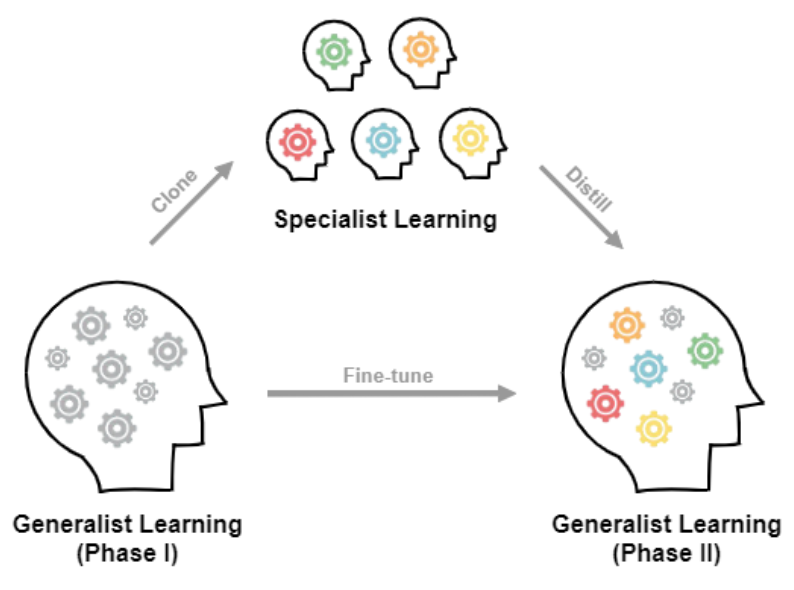
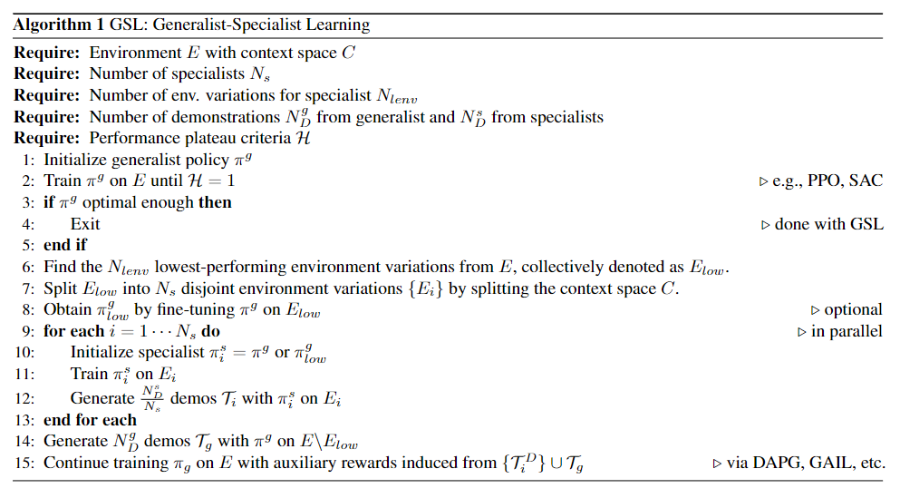

# Improving Policy Optimization with Generalist-Specialist Learning

This is the official repository for the RL framework called **GSL** presented in the following paper:

### **[Improving Policy Optimization with Generalist-Specialist Learning](https://zjia.eng.ucsd.edu/gsl)**<br>
Zhiwei Jia, Xuanlin Li, Zhan Ling, Shuang Liu, Yiran Wu, Hao Su<br>
UC San Diego<br>
ICML 2022<br>


<p align="center">
  <br>
  <a href="https://arxiv.org/abs/2206.12984">[arXiv]</a>&emsp;<a href="https://zjia.eng.ucsd.edu/gsl">[website]</a>
</p>

Generalist-specialist learning (GSL) is a meta-algorithm for large-scale policy learning.
We empirically observe that an agent trained on many variations (a **generalist**) tends to learn faster at the beginning, yet its performance plateaus at a less optimal level for a long time. 
In contrast, an agent trained only on a few variations (a **specialist**) can often achieve high returns under a limited computational budget. 
GSL is an effort to have the best of both worlds by combining generalist and specialist learning in a well-principled three-stage framework. 
We show that GSL pushes the envelope of policy learning on several challenging and popular benchmarks including [Procgen](https://openai.com/blog/procgen-benchmark/), [Meta-World](https://meta-world.github.io/) and [ManiSkill](https://sapien.ucsd.edu/challenges/maniskill2021/).

As a meta-algorithm, GSL can potentially work with any (actor-critic style) policy learning algorithms. 
We show the pseudocode (extracted from the main paper) as below.
Notice that GSL is relatively straightforward and easy to adapt to any modern RL frameworks.
In fact, in our experiments, we adapt GSL for PPO from [PFRL](https://github.com/pfnet/pfrl) on Procgen, PPG from [OpenAI-PPG](https://github.com/openai/phasic-policy-gradient) on Procgen, PPO from [garage](https://github.com/rlworkgroup/garage) for Meta-World, and SAC from [ManiSkill-Learn](https://github.com/haosulab/ManiSkill-Learn) for ManiSkill.
For better clarity, here in this repo, we only take [garage](https://github.com/rlworkgroup/garage) (which has the most stars among the abovementioned repos) as an example to demonstrate the key steps in adapting the GSL framework.

<p align="center">
  <br>
  Pseudocode of GSL
</p>

The garage repo provides the official PPO impl for experiments in Meta-World.
In this example, we use PPO and DAPG as the building blocks for GSL.
The first 8 steps of GSL are straightforward (phase I generalist learning) with little modifications required from the original repo. 
Starting from step 9, it launches speciaslist training (in parallel) and collect demonstrations in step 12.  
Normally, a modern RL framework provides an encapsulation for experience collected in an episode (e.g.., used in a replay buffer).
Here in garage it refers to the `EpisodeBatch` class ([link](https://github.com/rlworkgroup/garage/blob/f056fb8f6226c83d340c869e0d5312d61acf07f0/src/garage/_dtypes.py#L455)).
When we rollout the policy and store the demos, we utilize such encapsulation and add the following code as a class function to `class VPG` [here](https://github.com/rlworkgroup/garage/blob/f056fb8f6226c83d340c869e0d5312d61acf07f0/src/garage/torch/algos/vpg.py#L17), which is the parent class for the PPO impl:
```Python
    def store_demos(self, trainer, num_epochs, batch_size, path):
        """Obtain samples and store the demos.

        Args:
            trainer (Trainer): the trainer of the RL algorithm.
            num_epochs (int): the number of epochs of data to be collected.
            batch_size (int): the batch size of the episode to be collected.
            path (str): the output path for the demos to be stored.
        """
        trainer._train_args.batch_size = batch_size
        for i in range(num_epochs):
            eps = trainer.obtain_episodes(0)
            with open(f'{path}/{i}.pkl', 'wb') as f:
                pickle.dump(eps, f)
```
Then we call `trainer.store_demos(...)`, which in turn calls `VPG.store_demos(...)` to collect the demos.
We provide an example code in `demo_mt10.py` for the MT-10 task in Meta-World.
Notice that `--task_ids` specifies which the environment variations and since each specialist in this case only works on one variation, you will only specify one task idx here.
Step 14 is similar to step 12 except that for the generalist we will specify multiple environment variations with `--task_ids`.

Step 15 is for the phase II generalist learning, where we add the auxiliary reward (DAPG loss) in additional to the PPO losses to fine-tune the pretrained policy on all training environment variations.
Specifically, we first modify the `train(...)` function [here](https://github.com/rlworkgroup/garage/blob/f056fb8f6226c83d340c869e0d5312d61acf07f0/src/garage/torch/algos/vpg.py#L208) to filter the demos:
```Python
    def train(self, trainer, dapg=False, demo_args=None):
        """Obtain samplers and start actual training for each epoch.

        Args:
            trainer (Trainer): the trainer of the RL algorithm.
            dapg (bool): whether to add the DAPG loss.
            demo_args (dict): args for DAPG.
        Returns:
            float: The average return in last epoch cycle.

        """
        last_return = None
        demo_iter = None
        demo_coeff = None

        # Filter the demos.
        if dapg:
            assert demo_args is not None
            demo_bs, demo_freq, demo_coeff, seed = demo_args  # args for DAPG

            episodes = []
            base_path = f'/home/zjia/Research/MetaWorld/demos'  # Some path here.
            for p in os.listdir(base_path):
                if f'seed={seed}' not in p: continue  # Only use demos for the current seed.
                path = os.path.join(base_path, p)
                for j in os.listdir(path):
                    with open(os.path.join(path, j), 'rb') as f:
                        demo = pickle.load(f)
                    for d in demo.split():
                        if d.env_infos['success'].any():  # Only include successful demos.
                            episodes.append(d)
            demo_eps = EpisodeBatch.concatenate(*episodes)
            demo_obs_flat = np_to_torch(demo_eps.observations)
            demo_actions_flat = np_to_torch(demo_eps.actions)
            demo_iter = iter(get_minibatch(demo_bs, demo_obs_flat, demo_actions_flat))
        else:
            demo_iter, demo_freq, demo_coeff = None, None, None

        for _ in trainer.step_epochs():
            for _ in range(self._n_samples):
                eps = trainer.obtain_episodes(trainer.step_itr)
                # This function call below is modified from the original one.
                last_return = self._train_once(trainer.step_itr, eps, demo_iter, demo_freq, demo_coeff)
                trainer.step_itr += 1

        return last_return
```
With an additional helper function：
```Python
from garage.np.optimizers import BatchDataset

def get_minibatch(batch_size, *inputs):
    batch_dataset = BatchDataset(inputs, batch_size)
    for _ in range(100000000):  # To simulate an infinite loop
        for dataset in batch_dataset.iterate():
            yield dataset
```
This `train(...)` function will call `_train_once(...)` [here](https://github.com/rlworkgroup/garage/blob/f056fb8f6226c83d340c869e0d5312d61acf07f0/src/garage/torch/algos/vpg.py#L136), which we modify by changing the function signature:
```Python
    def _train_once(self, itr, eps, demo_iter=None, demo_freq=None, demo_coeff=None):
```
We also modify around [this](https://github.com/rlworkgroup/garage/blob/f056fb8f6226c83d340c869e0d5312d61acf07f0/src/garage/torch/algos/vpg.py#L175) line:
```Python
        self._train(obs_flat, actions_flat, rewards_flat,
                returns_flat, advs_flat, demo_iter, demo_freq, demo_coeff)
```
The code above further calls `_train(...)` [here](https://github.com/rlworkgroup/garage/blob/f056fb8f6226c83d340c869e0d5312d61acf07f0/src/garage/torch/algos/vpg.py#L230), which we modify as:
```Python
    def _train(self, obs, actions, rewards, returns, advs, demo_iter, demo_freq, demo_coeff):
        r"""Train the policy and value function with minibatch.

        Args:
            obs (torch.Tensor): Observation from the environment with shape
                :math:`(N, O*)`.
            actions (torch.Tensor): Actions fed to the environment with shape
                :math:`(N, A*)`.
            rewards (torch.Tensor): Acquired rewards with shape :math:`(N, )`.
            returns (torch.Tensor): Acquired returns with shape :math:`(N, )`.
            advs (torch.Tensor): Advantage value at each step with shape
                :math:`(N, )`.
            demo_iter: the iterator for providing demo data.
            demo_freq: how frequent the DAPG loss contribute to the overall training loss.
            demo_coeff: the coeff term for the DAPG loss.
        """
        i = 0
        max_adv = advs.max().detach()  # The max advantage for each epoch (used in DAPG).
        for dataset in self._policy_optimizer.get_minibatch(
                obs, actions, rewards, advs):
            d_obs, d_actions = None, None
            if demo_iter is not None and i % demo_freq == 0:
                d_obs, d_actions = next(demo_iter)
            self._train_policy(*dataset, d_obs, d_actions, demo_coeff, max_adv)
            i += 1
        for dataset in self._vf_optimizer.get_minibatch(obs, returns):
            self._train_value_function(*dataset)
```
Finally, we modify `_train_policy(...)` that includes the DAPG loss (an adapted version, see details in the paper):
```Python
    def _train_policy(self, obs, actions, rewards, advantages, demo_obs, demo_actions, demo_coeff, max_adv):
        r"""Train the policy.

        Args:
            obs (torch.Tensor): Observation from the environment
                with shape :math:`(N, O*)`.
            actions (torch.Tensor): Actions fed to the environment
                with shape :math:`(N, A*)`.
            rewards (torch.Tensor): Acquired rewards
                with shape :math:`(N, )`.
            advantages (torch.Tensor): Advantage value at each step
                with shape :math:`(N, )`.
            ...
            
        Returns:
            torch.Tensor: Calculated mean scalar value of policy loss (float).

        """
        zero_optim_grads(self._policy_optimizer._optimizer)
        loss = self._compute_loss_with_adv(obs, actions, rewards, advantages)
        if demo_obs is not None:
            # DAPG loss (adapted version)
            loss -= torch.exp(self.policy(demo_obs)[0].log_prob(demo_actions)).mean() * demo_coeff * max_adv
        loss.backward()
        self._policy_optimizer.step()

        return loss
```

